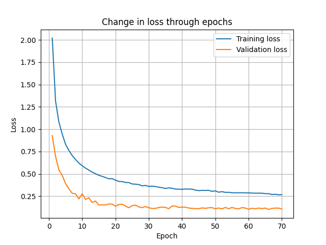
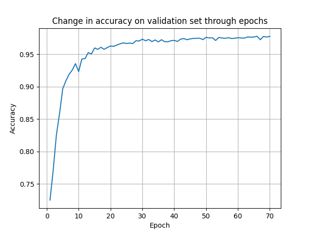
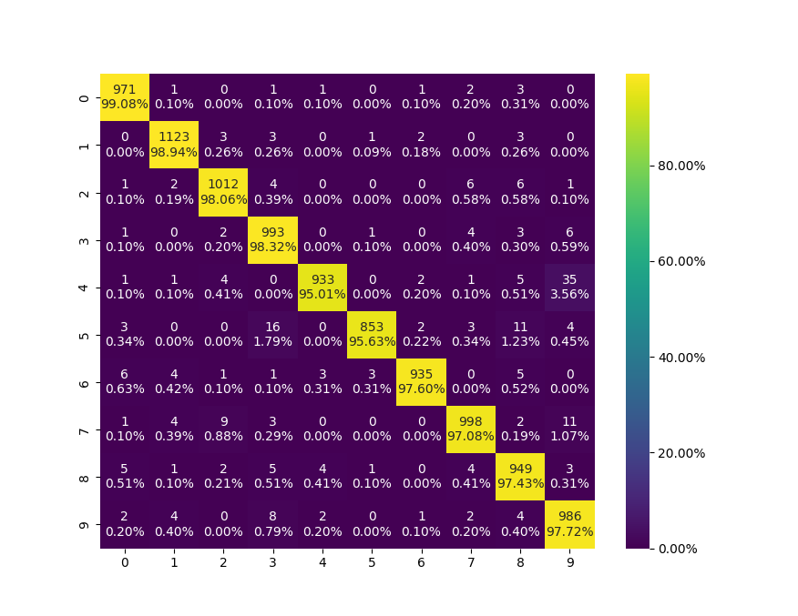
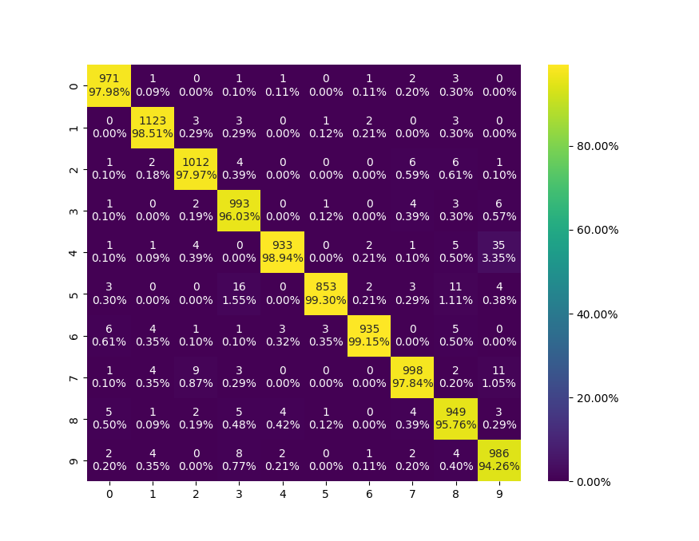
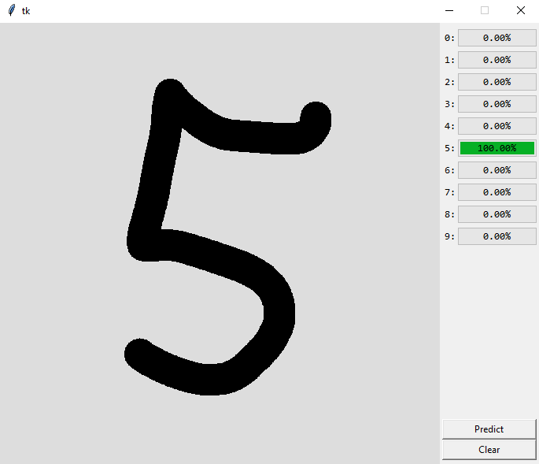

# Number-classification-mnist

Ranka rašytų skaičių klasifikacijai apmokytas daugiasluoksnis perceptronas. Apmokymo bei testavimo duomenis galima rasti [http://yann.lecun.com/exdb/mnist/](http://yann.lecun.com/exdb/mnist/). 10% apmokymo duomenų buvo panaudota sudarant validacijos duomenų imtį. Sukurtą modelį apibūdinančios diagramos pateiktos žemiau (Susimaišymo matricos sudarytos naudojant testavimo duomenis).
 

  
|  |
|:--:|
| *Tikslo funkcijos reikšmės priklausomybė nuo epochų skaičiaus* |

 

  
|  |
|:--:|
| *Tikslumo, apskaičiuoto naudojant validacijos duomenų rinkinį,  reikšmės priklausomybė nuo epochų skaičiaus* |

 

  
|  |
|:--:|
| *Eilučių atžvilgiu normalizuota susimaišymo matrica* |

 

  
|  |
|:--:|
| *Stulpelių atžvilgiu normalizuota susimaišymo matrica* |

 
Aplikacijos, leidžiančios išbandyti sukurtą skaičių klasifikacijos modelį, vartotojo sąsajos pavyzdys pateiktas žemiau.
 

  
|  |
|:--:|
| *Sukurtos aplikacijos vartotojo sąsajos pavyzdys* |

